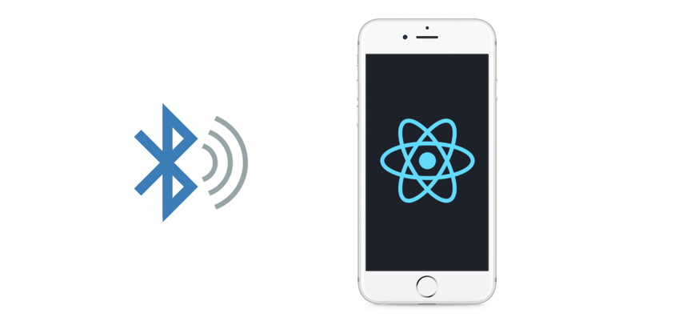
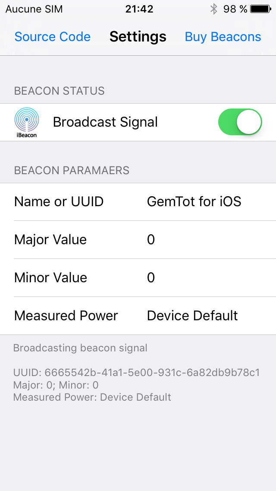

React Native: Beacons (iOS and Android)
======
[](https://github.com/MacKentoch/reactNativeBeaconExample)

<a target='_blank' rel='nofollow' href='https://app.codesponsor.io/link/Mp96tCWH2KdajZuBzqB6jwj8/MacKentoch/reactNativeBeaconExample'>
  
</a>

## This repository is related to my [medium article](https://medium.com/@erwan.datin/mmazzarolohow-to-play-with-ibeacons-in-a-react-native-application-5cef754b2edc#.jsz0loalm)
[](https://medium.com/@erwan.datin/mmazzarolohow-to-play-with-ibeacons-in-a-react-native-application-5cef754b2edc#.jsz0loalm)

## How to install

Assuming you already have:
- `NodeJS >= 6.x`
- `React Native` tools ([React Native website will explain better than me what it is about](https://facebook.github.io/react-native/docs/getting-started.html))

Steps to install:
- clone this repository
- install all npm dependencies
  ```bash
  npm install
  ```
  or
  ```javascript
  yarn install
  ```
- integrates dependencies in iOS and Android projects
```bash
react-native link
```

## iOS:
- iOS 8.0 minimum

> Don't forget to active Bluetooth and localization service on your device

*Note: this example app is already configured:*


## Android:
- target :
  - minimum to 21 `minSdkVersion` (*which means: android 5.0 LOLLIPOP*)

> Don't forget to active Bluetooth on your device (already done for you in this project)

## Beacon:

Any beacon should work just enter the right `uuid`.

#### You have no beacon... but you have an alternate iOS device, great!

This device can become your beacon like emitter thanks to [gemtot](https://github.com/gemtot/iBeacon)


